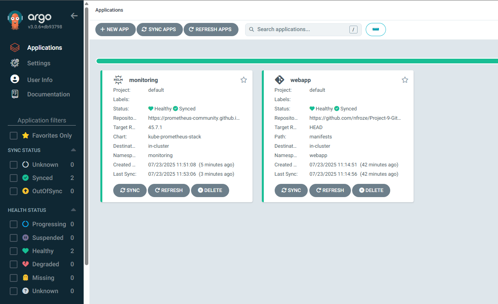
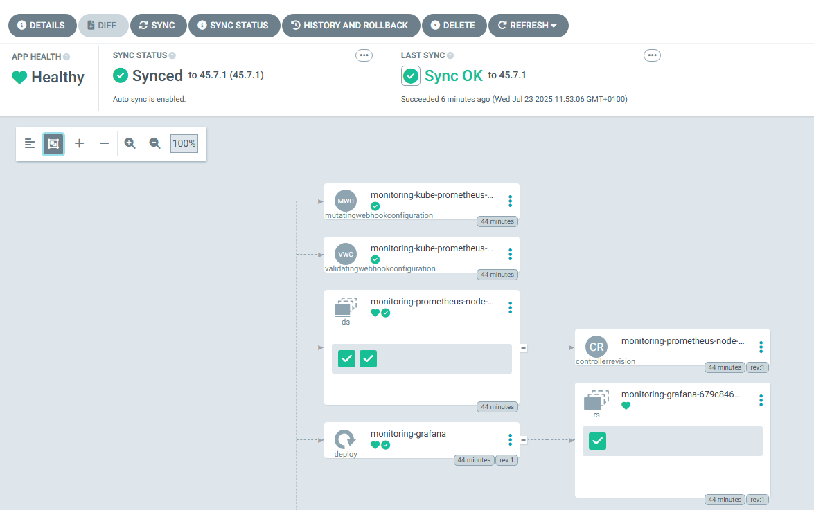
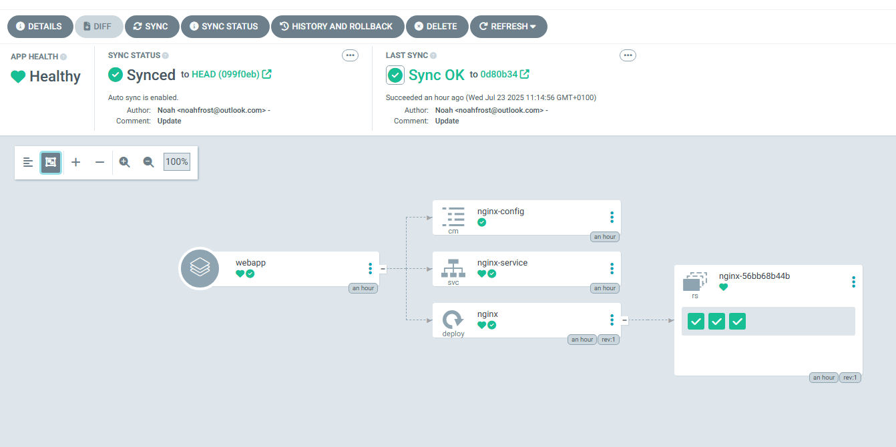
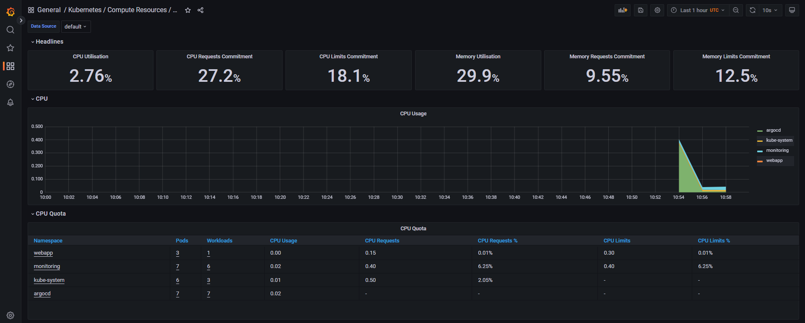
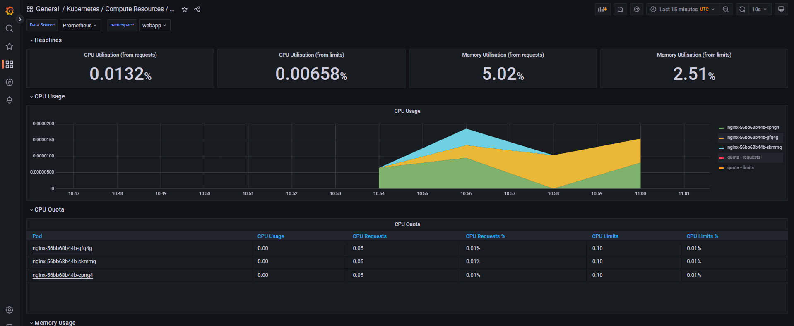
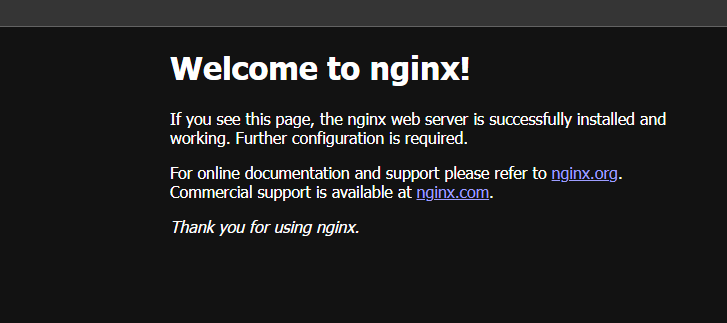
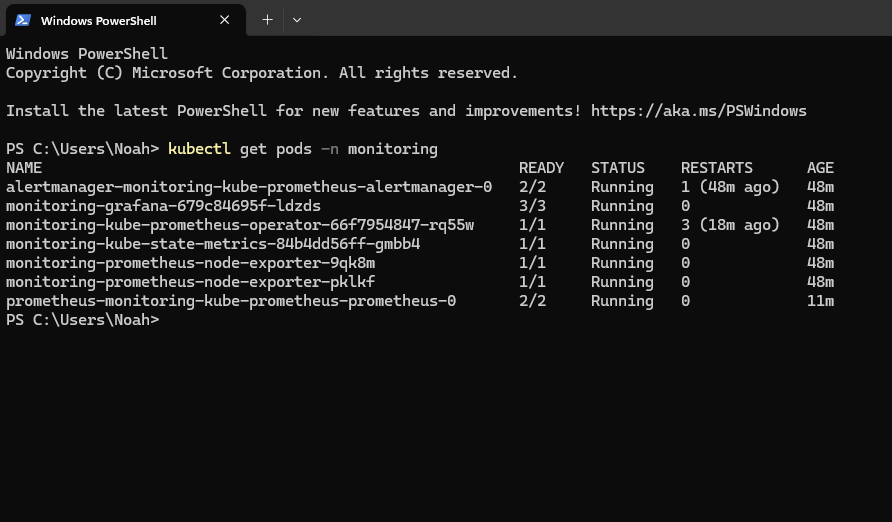
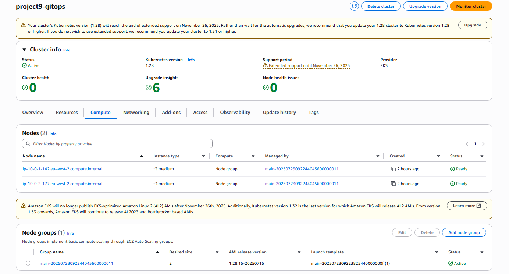

# GitOps Pipeline With ArgoCD

A fully automated GitOps delivery pipeline on AWS EKS where ArgoCD continuously reconciles infrastructure state from Git, eliminating manual kubectl deployments and configuration drift.

## Overview

In production environments, manual deployments create drift between what's defined in code and what's actually running. This project solves that by implementing a GitOps workflow where Git is the single source of truth — push a change, and ArgoCD automatically syncs the cluster to match.

The pipeline provisions an EKS cluster and VPC using Terraform, then hands deployment responsibility to ArgoCD. Two ArgoCD Applications manage the cluster: one deploys an Nginx-based web application from the repo's manifests directory, and another deploys a full Prometheus and Grafana monitoring stack via Helm. Both applications are configured with automated sync, self-healing, and pruning — if someone manually changes a resource in the cluster, ArgoCD reverts it.

This mirrors how platform teams operate in real organisations: infrastructure provisioned with IaC, application delivery handled through GitOps, and observability baked in from day one.

## Architecture

The system runs inside an AWS VPC in eu-west-2 spanning two availability zones. Terraform provisions the VPC with public and private subnets, a NAT gateway for outbound traffic, and an EKS cluster with two t3.medium managed nodes placed in the private subnets.

ArgoCD runs inside the cluster and watches two sources: the GitHub repository for application manifests, and the Prometheus community Helm chart repository for the monitoring stack. When changes are detected in either source, ArgoCD reconciles the cluster state automatically. The web application and Grafana dashboards are both exposed externally via LoadBalancer services.

## Tech Stack

**Infrastructure**: AWS EKS, VPC (multi-AZ), Terraform
**GitOps**: ArgoCD (automated sync, self-heal, prune)
**Monitoring**: Prometheus, Grafana (kube-prometheus-stack)
**Application**: Nginx on Kubernetes (Deployment, Service, ConfigMap)

## Key Decisions

- **GitOps over push-based CI/CD**: ArgoCD pulls desired state from Git rather than a pipeline pushing changes to the cluster. This means the cluster self-heals from drift and there's a clear audit trail of every change through Git history.

- **kube-prometheus-stack via ArgoCD Application**: Rather than installing monitoring with Helm CLI commands, the entire monitoring stack is declared as an ArgoCD Application. This means monitoring itself is GitOps-managed — if someone deletes Grafana, ArgoCD recreates it.

- **Private subnet placement with public endpoints**: EKS nodes run in private subnets for security, while the cluster API endpoint remains publicly accessible for management. NAT gateway handles outbound traffic for container image pulls.

- **Single NAT gateway**: Chose cost efficiency over high availability for this non-production workload, while still demonstrating the correct architectural pattern of private node placement.

## Screenshots

**ArgoCD Applications Overview** — Two ArgoCD Applications are defined and deployed in the cluster: one for the Nginx web application and another for the Prometheus monitoring stack. This view shows both applications initialized and ready for synchronization.

**ArgoCD Applications List** — The full applications list view in ArgoCD displays multiple deployed applications with their status indicators and configuration details. The interface shows real-time synchronization status and recent activity for each application.

**Nginx Application Sync Status** — A detailed dependency tree showing the complete resource hierarchy of the Nginx application. The sync status is healthy with all components synced, including the nginx-config ConfigMap, nginx-service Service, nginx Deployment, and underlying Pod replicas (nginx-56bb68b44b), with each component showing individual sync success timestamps.

**Grafana CPU Metrics Dashboard** — Real-time CPU utilization metrics displayed in Grafana showing multiple key performance indicators (2.76%, 27.2%, 18.1%, 29.9%, 9.55%, 12.5%) with a detailed time-series graph tracking CPU usage patterns across the cluster resources.

**Grafana Memory Metrics Dashboard** — Memory usage statistics displayed in Grafana showing key metrics (0.0132%, 0.00658%, 5.02%, 2.51%) with a stacked area chart visualization illustrating memory consumption trends over time with distinct color bands for different memory categories.

**Nginx Welcome Page** — The default Nginx landing page confirming successful deployment and accessibility of the web application. The page displays the standard "Welcome to nginx!" message with links to nginx.org documentation, confirming the Kubernetes Nginx service is properly exposed and responding to requests.

**kubectl Monitoring Pods** — PowerShell output from `kubectl get pods -n monitoring` command showing all running Prometheus monitoring stack components, including AlertManager (2/2 ready), Grafana instance (3/3 ready), Prometheus Operator (1/1 ready), kube-state-metrics, and multiple Prometheus node exporters, all in Running status and deployed within the monitoring namespace.

**Prometheus Alert Rules** — Prometheus AlertManager view displaying the configured alert rules grouped by their alert groups. The interface shows alert rules in a managed state with rule summaries and their current status, providing visibility into the monitoring and alerting configuration for the cluster.

## Author

**Noah Frost**

- Website: [noahfrost.co.uk](https://noahfrost.co.uk)
- GitHub: [github.com/nfroze](https://github.com/nfroze)
- LinkedIn: [linkedin.com/in/nfroze](https://linkedin.com/in/nfroze)
