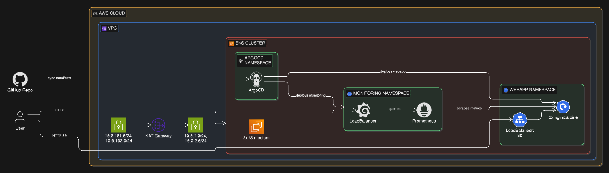

# GitOps Pipeline With ArgoCD

A fully automated GitOps delivery pipeline on AWS EKS where ArgoCD continuously reconciles infrastructure state from Git, eliminating manual kubectl deployments and configuration drift.

## Overview

In production environments, manual deployments create drift between what's defined in code and what's actually running. This project solves that by implementing a GitOps workflow where Git is the single source of truth — push a change, and ArgoCD automatically syncs the cluster to match.

The pipeline provisions an EKS cluster and VPC using Terraform, then hands deployment responsibility to ArgoCD. Two ArgoCD Applications manage the cluster: one deploys an Nginx-based web application from the repo's manifests directory, and another deploys a full Prometheus and Grafana monitoring stack via Helm. Both applications are configured with automated sync, self-healing, and pruning — if someone manually changes a resource in the cluster, ArgoCD reverts it.

This mirrors how platform teams operate in real organisations: infrastructure provisioned with IaC, application delivery handled through GitOps, and observability baked in from day one.

## Architecture

The system runs inside an AWS VPC in eu-west-2 spanning two availability zones. Terraform provisions the VPC with public and private subnets, a NAT gateway for outbound traffic, and an EKS cluster with two t3.medium managed nodes placed in the private subnets.

ArgoCD runs inside the cluster and watches two sources: the GitHub repository for application manifests, and the Prometheus community Helm chart repository for the monitoring stack. When changes are detected in either source, ArgoCD reconciles the cluster state automatically. The web application and Grafana dashboards are both exposed externally via LoadBalancer services.

## Tech Stack

**Infrastructure**: AWS EKS, VPC (multi-AZ), Terraform
**GitOps**: ArgoCD (automated sync, self-heal, prune)
**Monitoring**: Prometheus, Grafana (kube-prometheus-stack)
**Application**: Nginx on Kubernetes (Deployment, Service, ConfigMap)

## Key Decisions

- **GitOps over push-based CI/CD**: ArgoCD pulls desired state from Git rather than a pipeline pushing changes to the cluster. This means the cluster self-heals from drift and there's a clear audit trail of every change through Git history.

- **kube-prometheus-stack via ArgoCD Application**: Rather than installing monitoring with Helm CLI commands, the entire monitoring stack is declared as an ArgoCD Application. This means monitoring itself is GitOps-managed — if someone deletes Grafana, ArgoCD recreates it.

- **Private subnet placement with public endpoints**: EKS nodes run in private subnets for security, while the cluster API endpoint remains publicly accessible for management. NAT gateway handles outbound traffic for container image pulls.

- **Single NAT gateway**: Chose cost efficiency over high availability for this non-production workload, while still demonstrating the correct architectural pattern of private node placement.

## Screenshots

## Author

**Noah Frost**

- Website: [noahfrost.co.uk](https://noahfrost.co.uk)
- GitHub: [github.com/nfroze](https://github.com/nfroze)
- LinkedIn: [linkedin.com/in/nfroze](https://linkedin.com/in/nfroze)
